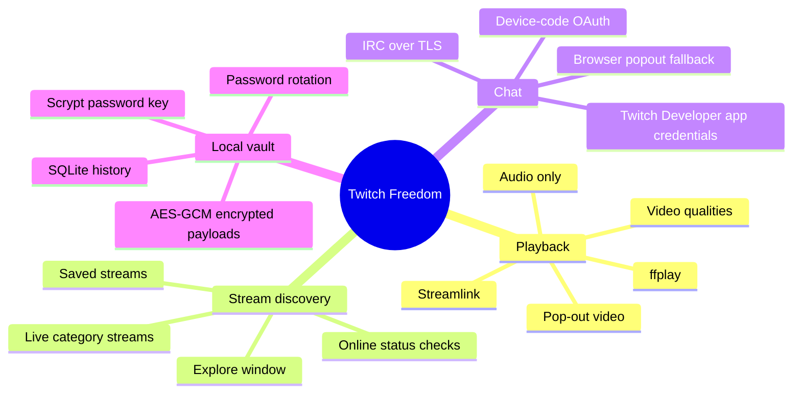
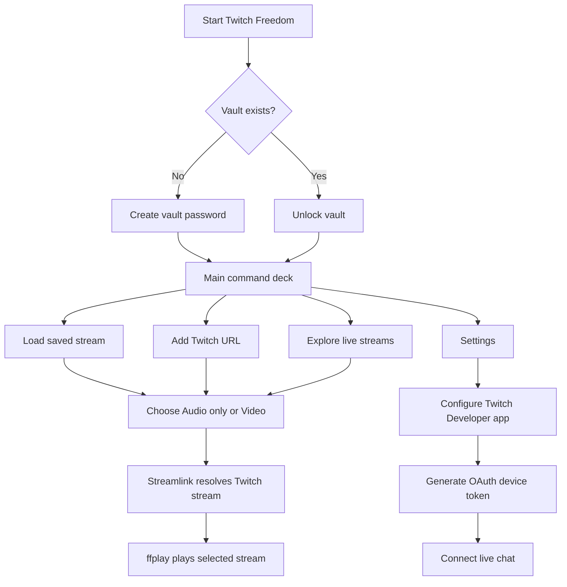
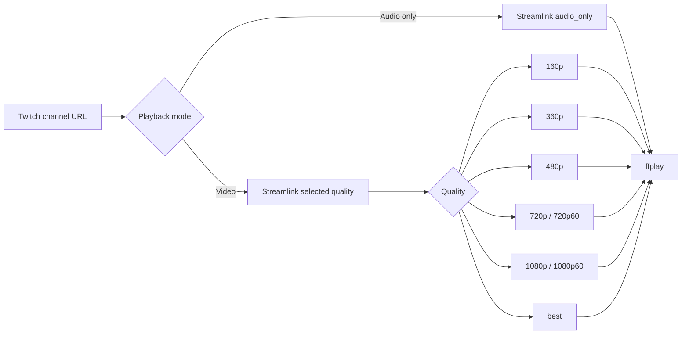
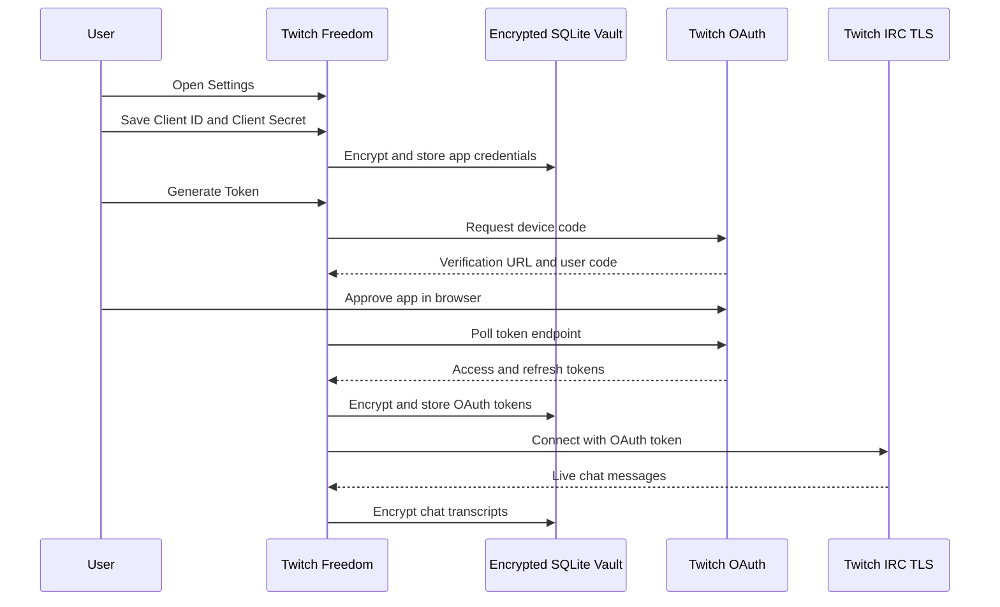
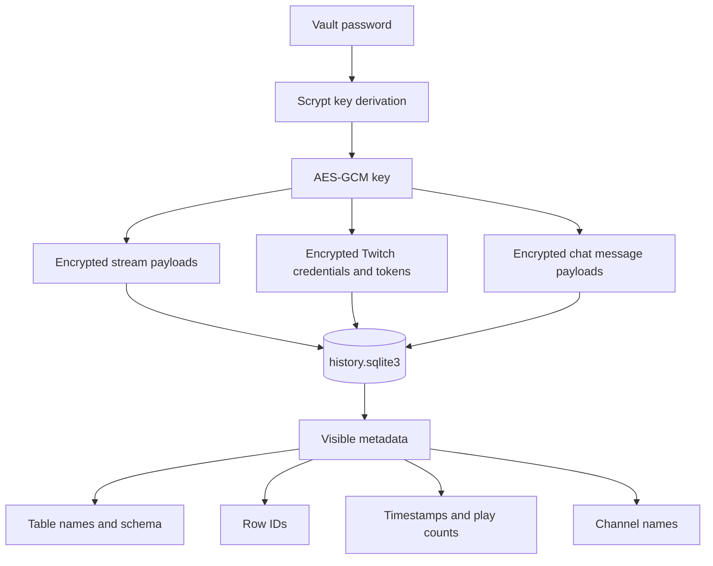

# Twitch Freedom

Twitch Freedom is a compact CustomTkinter desktop app for launching Twitch streams with Streamlink and `ffplay`, saving stream history in a local encrypted SQLite vault, browsing live Twitch streams from inside the app, and joining Twitch chat through a Twitch Developer application configured in Settings.

The current implementation lives in `main.py`.

> Note: the code may still contain legacy internal names such as `TwitchAudio` for app directories, window titles, or migration compatibility. This README uses the new product name: **Twitch Freedom**.


## What Changed

- Renamed the project-facing documentation from **TwitchAudio** to **Twitch Freedom**.
- Added the logo to the README with `logo.png`.
- Updated the app description: Twitch Freedom is no longer audio-only.
- Documented both playback modes:
  - `Audio only`
  - `Video`
- Documented the built-in stream list / Explore flow.
- Documented live Twitch chat setup through a Twitch Developer application in Settings.
- Added Mermaid diagrams for architecture, playback, OAuth/chat setup, and encrypted storage.
- Kept the local vault, encrypted stream history, OAuth tokens, and chat transcript behavior from the current implementation.

## Feature Overview



## Current Features

- Twitch stream playback through Streamlink and `ffplay`.
- Audio-only playback through Streamlink's `audio_only` stream.
- Video playback with selectable quality: `160p`, `360p`, `480p`, `720p`, `720p60`, `1080p`, `1080p60`, and `best`.
- Dark CustomTkinter interface with stream controls, saved-stream cards, status text, diagnostics, settings, video controls, and chat controls.
- Sidebar logo loaded from `logo.png`.
- Saved stream list with play counts, last-played timestamps, playback mode, quality, and volume.
- Explore window for discovering live Twitch streams by category.
- Built-in categories currently include:
  - Software and Game Development
  - Science and Technology
- Optional online/offline status checks for saved channels when Twitch credentials are configured.
- Password-gated local SQLite vault on first launch.
- AES-256-GCM encrypted JSON payloads with keys derived from the vault password using Scrypt.
- Encrypted storage for Twitch app credentials, OAuth access tokens, OAuth refresh tokens, and chat transcripts.
- Twitch OAuth device-code flow for chat authentication.
- Live in-app Twitch IRC chat over TLS.
- Browser popout chat fallback that does not require OAuth storage.
- Automatic Twitch access-token refresh before chat/API use.
- Chat message sanitization, bounded chat history, and encrypted chat transcript storage.
- Encrypted password rotation from inside the app.
- Live volume slider; playback may restart so the new `ffplay` volume filter takes effect.
- Stream history trimming to the newest 80 records.
- Chat trimming to the newest 400 messages per channel.

## App Flow



## Requirements

### System packages

- Python 3.10 or newer.
- FFmpeg with `ffplay` on your `PATH`.
- Tk support for Python.
- Streamlink, installed through Python dependencies.

Ubuntu/Debian:

```bash
sudo apt update
sudo apt install -y ffmpeg python3-tk python3-venv
```

Optional Linux audio diagnostics:

```bash
sudo apt install -y alsa-utils
```

### Python packages

`requirements.txt` should include the runtime packages used by the app:

```txt
customtkinter==5.2.2
cryptography==42.0.0
streamlink==6.8.0
```

`bleach` is optional. When installed, it is used for stronger text sanitization. Without it, the app falls back to built-in HTML stripping.

## Install From A Local Checkout

```bash
git clone https://github.com/ornab74/twitchaudio.git
cd twitchaudio
python3 -m venv .venv
source .venv/bin/activate
python3 -m pip install --upgrade pip
python3 -m pip install -r requirements.txt
```

On Windows PowerShell:

```powershell
.\.venv\Scripts\Activate.ps1
python -m pip install --upgrade pip
python -m pip install -r requirements.txt
```

## Run

Linux/macOS:

```bash
python3 main.py
```

Windows:

```powershell
python main.py
```

On first launch, create a vault password. On later launches, enter that password to unlock saved streams, settings, OAuth tokens, and chat transcripts.

If the vault password is lost, encrypted saved data cannot be recovered.

## How To Use

1. Start the app with `python3 main.py`.
2. Create or enter your local vault password.
3. Use **Add Stream** to paste a Twitch channel URL, load an existing saved stream, or open **Explore** to browse live streams.
4. Choose **Audio only** for the lowest-bandwidth mode, or choose **Video** and select a Streamlink quality.
5. Start playback.
6. Adjust volume if needed.
7. Use saved stream cards to replay, load, or delete previous streams.
8. Open **Explore** to load or play streams from the in-app live stream list.
9. Open **Settings** to configure Twitch chat authentication.
10. Connect in-app chat after OAuth setup, or open browser popout chat without authentication.
11. Stop playback when finished.

## Playback Modes



Audio-only mode asks Streamlink for the `audio_only` variant and pipes it into `ffplay`.

Video mode lets Streamlink play the selected quality through `ffplay`. Available stream variants depend on the live Twitch channel and what Twitch exposes through Streamlink.

Changing volume may briefly interrupt playback because `ffplay` receives volume as a startup audio filter. Twitch Freedom restarts playback when needed so the new volume takes effect.

## Stream List and Explore

Twitch Freedom keeps a local saved stream list and also includes an Explore window for live discovery.

Saved stream cards include:

| Field | Purpose |
| --- | --- |
| Title/channel | Human-readable stream label derived from the Twitch URL. |
| URL | Twitch channel URL. |
| Playback mode | Audio-only or video. |
| Quality | Saved Streamlink quality. |
| Volume | Saved playback volume. |
| Play count | Number of recorded launches. |
| Last played | Last launch timestamp. |
| Online status | Status indicator when Twitch API credentials are available. |

Explore currently loads live category streams from Twitch through the Helix API after Twitch credentials are configured. Each stream card can be loaded into the main controls or started directly.

## Twitch Chat Setup

Twitch Freedom supports two chat modes:

| Mode | Setup | Notes |
| --- | --- | --- |
| In-app live chat | Create a Twitch Developer application, save Client ID and Client Secret in Settings, then generate a device-code token. | Uses Twitch IRC over TLS for reading and Twitch Helix for sending normal chat messages. |
| Browser popout | Open the popout chat option in the chat area. | Opens Twitch chat in your default browser and does not require storing OAuth credentials. |

### Create a Twitch Developer Application

1. Go to the Twitch Developer Console.
2. Create or register an application.
3. Copy the **Client ID**.
4. Create and copy the **Client Secret**.
5. Open Twitch Freedom.
6. Open **Settings**.
7. Paste the Client ID and Client Secret.
8. Click **Save App**.
9. Click **Generate Token**.
10. Open the displayed verification URL in a browser.
11. Enter the displayed user code.
12. Return to Twitch Freedom after authorization completes.

Twitch Freedom requests these chat scopes:

```txt
chat:read user:write:chat
```

The app stores Twitch credentials and OAuth tokens encrypted in the local vault. It refreshes access tokens automatically when they are near expiry.

## Twitch Chat Flow



## Local Storage

Twitch Freedom stores data in a SQLite file named `history.sqlite3`.

Default locations in the current implementation:

| OS | Location |
| --- | --- |
| Linux | `$XDG_DATA_HOME/twitchaudio/history.sqlite3` or `~/.local/share/twitchaudio/history.sqlite3` |
| macOS | `~/Library/Application Support/TwitchAudio/history.sqlite3` |
| Windows | `%APPDATA%\\TwitchAudio\\history.sqlite3` |

If an older `~/.twitchaudio` directory already exists, the app keeps using it so existing local data remains available.

The SQLite database contains these logical areas:

| Table | Purpose |
| --- | --- |
| `meta` | Vault salt, KDF metadata, verifier, and creation metadata. |
| `streams` | Encrypted saved stream payloads plus visible timestamps and play counts. |
| `settings` | Encrypted Twitch credentials and OAuth token state. |
| `chat_messages` | Encrypted per-channel chat transcript payloads. |

## Storage Architecture



## Security Model

Twitch Freedom uses application-level encryption for sensitive payloads. It is designed to keep stream details, chat content, and Twitch credentials private at rest without requiring SQLCipher.

Encrypted:

- Stream title, URL, playback mode, quality, and volume.
- Twitch Client ID and Client Secret.
- Twitch login name.
- Twitch OAuth access token and refresh token.
- Chat message user, body, and direction.

Visible in SQLite:

- Table names and schema.
- Row IDs.
- Stream timestamps and play counts.
- Chat channel names and message timestamps.
- Metadata keys such as `salt`, `kdf`, `verifier`, and `created_at`.

Implementation details:

- Passwords are not stored directly.
- Each vault has a random salt.
- The vault key is derived with Scrypt.
- Payloads are sealed with AES-GCM.
- Password rotation re-encrypts saved stream records, settings, and chat payloads with a new derived key.

For full database-file encryption, use SQLCipher or a platform-level encrypted filesystem. Twitch Freedom intentionally keeps setup simple by encrypting sensitive payloads inside the app.

## Project Layout

```txt
.
├── main.py
├── requirements.txt
├── pyproject.toml
├── README.md
├── LICENSE
├── .gitignore
├── logo.png
└── demo.png
```

Important files:

| File | Purpose |
| --- | --- |
| `main.py` | Current CustomTkinter app, encrypted storage, Twitch OAuth/chat, stream discovery, and Streamlink/ffplay process handling. |
| `requirements.txt` | Runtime Python dependencies for local runs. |
| `pyproject.toml` | Project metadata and dependency declarations. |
| `logo.png` | Logo used by the app and this README. |
| `demo.png` | Optional GUI preview image. |

## Development Checks

Syntax check:

```bash
python3 -m py_compile main.py
```

Whitespace check:

```bash
git diff --check
```

Check current repo changes:

```bash
git status --short
```

## Troubleshooting

If the app says `Missing Python dependency: customtkinter`, install the Python dependencies in your virtual environment:

```bash
python3 -m pip install -r requirements.txt
```

If the app says `Missing tools: streamlink` or `Missing tools: ffplay`, reinstall dependencies and make sure both tools are on your `PATH`:

```bash
python3 -m pip install -r requirements.txt
sudo apt install -y ffmpeg
```

If the GUI fails to open on Linux, install Tk support:

```bash
sudo apt install -y python3-tk
```

If a Twitch stream will not start, make sure the channel is live and Streamlink can see the selected quality:

```bash
streamlink https://www.twitch.tv/beardhero audio_only --stream-url
```

If video does not play, try a lower quality:

```bash
streamlink https://www.twitch.tv/beardhero 720p --stream-url
```

If Linux audio seems broken outside the app, test the system audio stack:

```bash
speaker-test -t wav -c 2
```

If in-app chat will not connect:

- Confirm the Twitch Developer app Client ID and Client Secret are saved in Settings.
- Generate a fresh device-code token.
- Confirm the Twitch account granted `chat:read` and `user:write:chat`.
- Use browser popout chat as a no-auth fallback.
