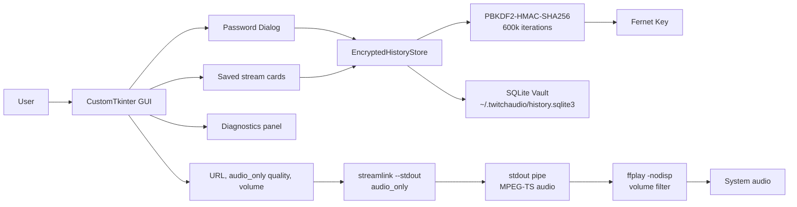
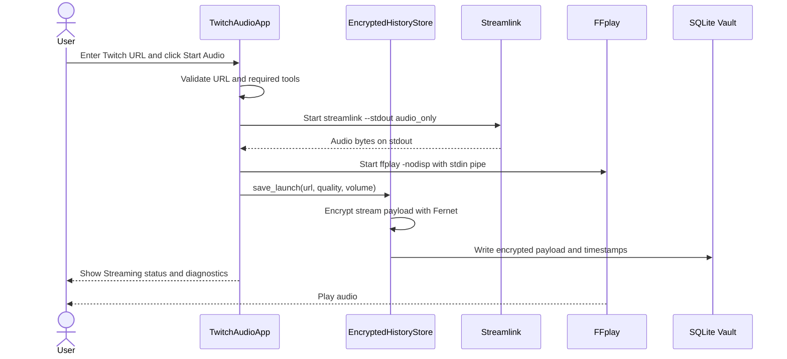
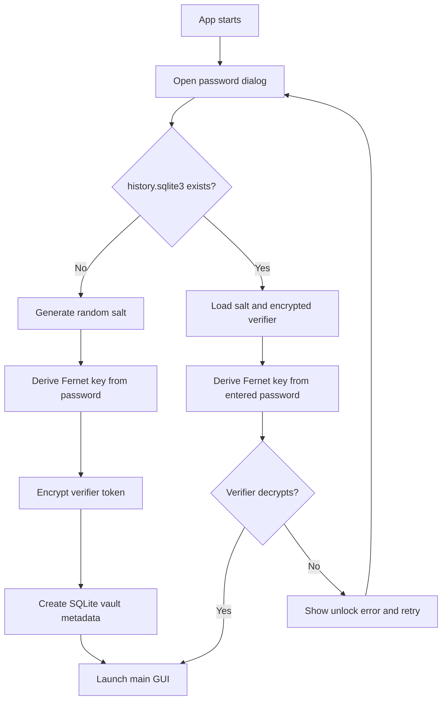
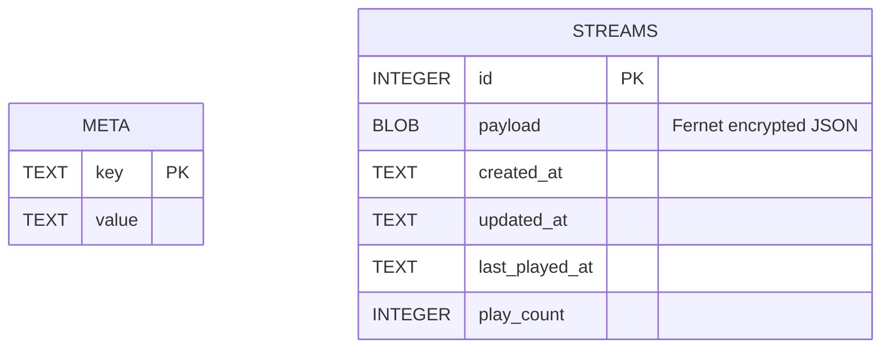
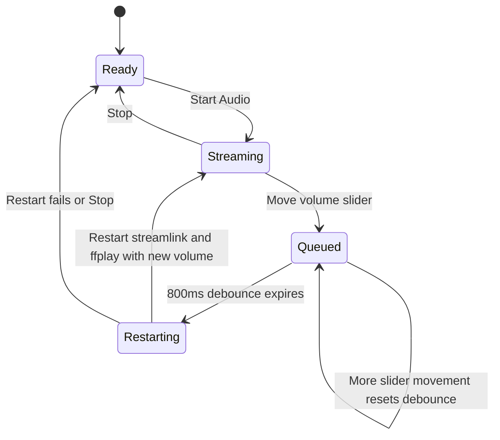

# TwitchAudio

Low-bandwidth Twitch listening with a dark CustomTkinter command deck.

TwitchAudio is a tiny desktop app that asks Streamlink for Twitch's `audio_only` stream and pipes that stream directly into `ffplay`. The goal is simple: hear the stream without downloading the 1080p video feed. It also keeps your saved stream history in a local SQLite vault where stream payloads are encrypted with a password-derived key.


## Table Of Contents

- [Highlights](#highlights)
- [Design Goals](#design-goals)
- [Architecture](#architecture)
- [Playback Flow](#playback-flow)
- [Vault Unlock Flow](#vault-unlock-flow)
- [Storage Model](#storage-model)
- [Volume Flow](#volume-flow)
- [Requirements](#requirements)
- [Ubuntu/Debian Packages](#ubuntudebian-packages)
- [Install](#install)
- [Run](#run)
- [How To Use](#how-to-use)
- [Security Model](#security-model)
- [Troubleshooting](#troubleshooting)
- [Project Map](#project-map)
- [Development Checks](#development-checks)

## Highlights

- Audio-only Twitch playback designed for low-bandwidth connections.
- Dark CustomTkinter UI with stream controls, diagnostics, status cards, and saved-stream cards.
- Password gate on launch for the encrypted local history vault.
- Saved stream history stored at `~/.twitchaudio/history.sqlite3`.
- Stream URLs, display titles, quality, and volume settings encrypted before SQLite writes.
- One-click BeardHero preset.
- Play, load, and delete saved streams from the history panel.
- Live volume slider with a debounced audio-pipe restart so `ffplay` receives the new filter.
- Change the history vault password from inside the app.
- Clear saved stream history without touching source files.

## Design Goals

- Keep bandwidth tiny by requesting only Twitch's `audio_only` stream variant.
- Avoid saving downloaded audio or video to disk.
- Keep the UI friendly enough for quick use and detailed enough for troubleshooting.
- Encrypt the saved stream payloads without requiring SQLCipher or system database setup.
- Keep the app portable as one Python file plus a small dependency list.

## Architecture



## Playback Flow



## Vault Unlock Flow



## Storage Model



The `streams.payload` blob contains the encrypted JSON for URL, title, quality, and volume. The timestamp and play-count fields stay outside the encrypted payload so the app can sort history without decrypting every metadata field into separate columns.

## Volume Flow



`ffplay` receives volume as a startup audio filter, so the app cannot push a new filter into an already-running `ffplay` process. TwitchAudio solves that by waiting briefly after slider movement and restarting the audio pipe with the new volume. You may hear a small blip, but the stream remains `audio_only`.

## Requirements

- Python 3.10 or newer.
- FFmpeg with `ffplay`.
- Tk support for Python.
- Audio test tools from `alsa-utils`.
- Python virtual environment support from `python3-venv`.
- Python packages from `requirements.txt`.

`requirements.txt` currently pins:

```txt
customtkinter==5.2.2
cryptography==42.0.0
streamlink==6.8.0
```

## Ubuntu/Debian Packages

Install the system packages first:

```bash
sudo apt update
sudo apt install -y ffmpeg python3-tk python3-venv alsa-utils
```

What those packages provide:

| Package | Why it is needed |
| --- | --- |
| `ffmpeg` | Provides `ffplay`, which plays Twitch `audio_only` MPEG-TS/AAC audio reliably. |
| `python3-tk` | Provides Tkinter support required by CustomTkinter. |
| `python3-venv` | Provides `python3 -m venv` for isolated Python installs. |
| `alsa-utils` | Provides audio tools like `speaker-test` and `aplay` for Linux audio diagnostics. |

Optional diagnostic player:

```bash
sudo apt install -y mpg123
```

`mpg123` is not required by the app. It was useful during troubleshooting, but the final app uses `ffplay` because Twitch's `audio_only` stream is typically AAC audio inside an MPEG-TS/HLS stream, not plain MP3.

## Install

On Ubuntu or Debian:

```bash
sudo apt update
sudo apt install -y ffmpeg python3-tk python3-venv alsa-utils
python3 -m pip install -r requirements.txt
```

If `streamlink` is not available on your `PATH` after installing requirements:

```bash
python3 -m pip install --user -r requirements.txt
```

Optional virtual environment setup:

```bash
python3 -m venv .venv
source .venv/bin/activate
python3 -m pip install -r requirements.txt
```

## Run

```bash
python3 main.py
```

On first launch, create a vault password. On later launches, enter the same password to unlock saved streams.

If the password is lost, the saved stream history cannot be recovered.

## How To Use

1. Launch the app with `python3 main.py`.
2. Enter or create your history vault password.
3. Paste a Twitch stream URL, or click `Use BeardHero`.
4. Keep quality on `audio_only`.
5. Click `Start Audio`.
6. Move the volume slider if needed.
7. Use `Play`, `Load`, or `Delete` on saved history cards.
8. Click `Stop` when you are done.

## How It Saves Streams

When a stream starts, TwitchAudio creates a payload with the stream title, URL, quality, and volume. That payload is serialized to JSON, encrypted with Fernet, and stored in SQLite. The saved-stream card view decrypts records only after the vault is unlocked with the correct password.

The app trims history to the newest 80 saved records.

## Bandwidth Notes

TwitchAudio is locked to `audio_only`, so it does not accidentally request video variants.

Typical Twitch audio-only usage is roughly 60-80 MB per hour. A 1080p stream can use multiple GB per hour. Actual bandwidth depends on Twitch's current stream variants and your network.

## Security Model

TwitchAudio uses lightweight app-level encryption. It is useful for keeping saved stream details private at rest, but it is not the same thing as full database encryption.

Encrypted:

- Stream URL.
- Display title.
- Quality setting.
- Volume setting.

Still visible in SQLite:

- Table structure.
- Row IDs.
- Created, updated, and last-played timestamps.
- Play counts.
- Metadata keys such as `salt`, `verifier`, and `created_at`.

Key details:

- Passwords are not stored directly.
- A random salt is generated for the vault.
- Keys are derived with PBKDF2-HMAC-SHA256 using 600,000 iterations.
- A short verifier token is encrypted to confirm whether the password can unlock the vault.
- Changing the vault password re-encrypts saved stream payloads with a new password-derived key.

If you need full-file encrypted SQLite, use SQLCipher or a platform-level encrypted filesystem. This project intentionally keeps setup simple by encrypting payloads in the app.

## Troubleshooting

If the app says `Missing Python dependency: customtkinter`, install Python dependencies:

```bash
python3 -m pip install -r requirements.txt
```

If the app says `Missing tools: streamlink` or `Missing tools: ffplay`, install dependencies and make sure they are on your `PATH`:

```bash
sudo apt update
sudo apt install -y ffmpeg python3-tk python3-venv alsa-utils
python3 -m pip install --user -r requirements.txt
```

If audio does not start, make sure the Twitch channel is live and Streamlink can see an `audio_only` variant:

```bash
streamlink https://www.twitch.tv/beardhero audio_only --stream-url
```

If the GUI fails to open on Linux, make sure Tk is installed:

```bash
sudo apt install -y python3-tk
```

If you want to test whether Linux audio works before launching the app:

```bash
speaker-test -t wav -c 2
```

If volume changes cause a brief cutout, that is expected. TwitchAudio restarts `ffplay` so the new volume filter takes effect.

## Project Map

```txt
.
├── main.py
├── requirements.txt
├── README.md
├── LICENSE
├── .gitignore
└── demo.png
```

## Code Map

- `EncryptedHistoryStore`: SQLite schema, vault unlock, encryption, decryption, password rotation, history trimming.
- `PasswordDialog`: first-run vault creation and later unlock dialog.
- `PasswordChangeDialog`: vault password rotation UI.
- `StreamCard`: saved-stream card UI.
- `TwitchAudioApp`: main window, Streamlink/ffplay process lifecycle, diagnostics, live volume debounce, history actions.
- `unlock_history`: password-gated app startup.
- `main`: CustomTkinter theme setup and app launch.

## Process Commands

The app starts Streamlink like this:

```bash
streamlink --loglevel none --stdout --twitch-disable-ads --stream-segment-threads 2 https://www.twitch.tv/beardhero audio_only
```

The Streamlink stdout pipe is connected into ffplay like this:

```bash
ffplay -nodisp -autoexit -f mpegts -af volume=2.0 -fflags nobuffer -flags low_delay -
```

The `-` at the end tells `ffplay` to read from standard input.

## Development Checks

Syntax check:

```bash
python3 -m py_compile main.py
```

Whitespace check:

```bash
git diff --check
```

Check current repo changes:

```bash
git status --short
```

## License

MIT. See `LICENSE`.
