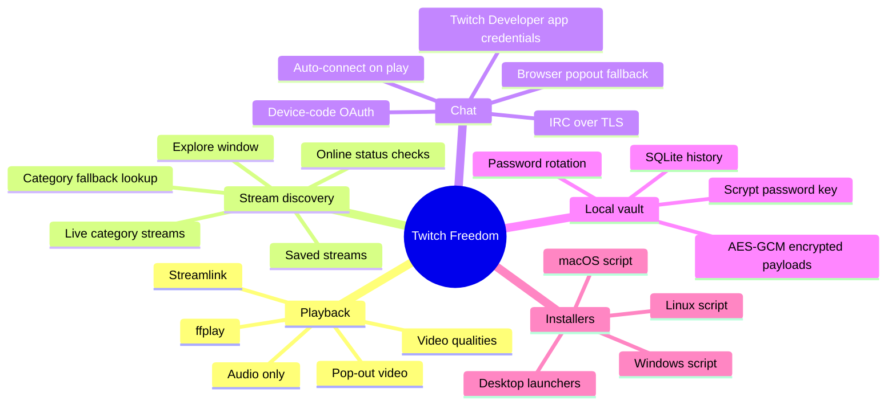
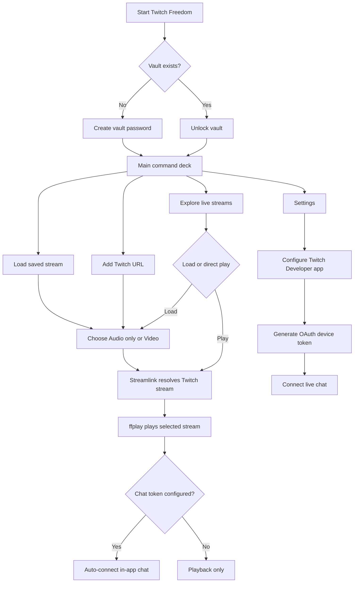
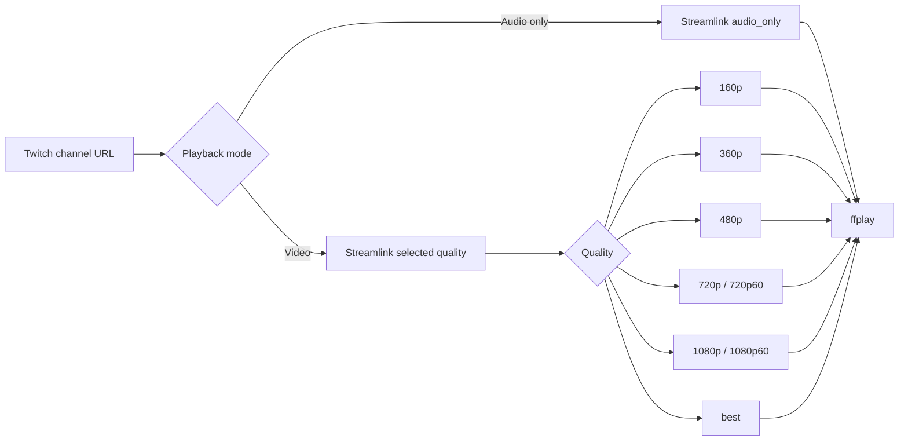
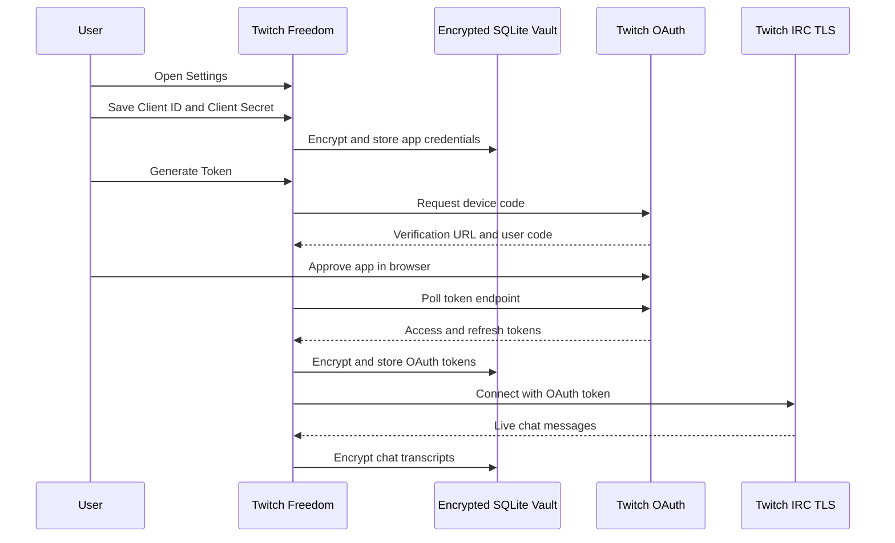
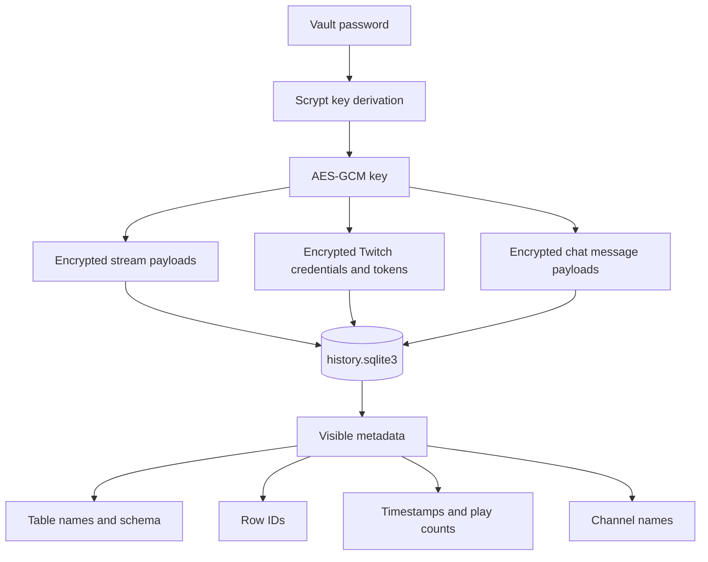

# Twitch Freedom

Twitch Freedom is a compact CustomTkinter desktop app for launching Twitch streams with Streamlink and `ffplay`, saving stream history in a local encrypted SQLite vault, browsing live Twitch streams from inside the app, and joining Twitch chat through a Twitch Developer application configured in Settings.

It is built for people who want Twitch playback without keeping a full browser tab open: paste a channel, browse live categories, choose audio-only or video quality, start playback, and keep chat available from the same small desktop window.

The current implementation lives in `main.py`.

> Note: the code may still contain legacy internal names such as `TwitchAudio` for app directories, window titles, or migration compatibility. This README uses the new product name: **Twitch Freedom**.


## Feature Overview



## Current Features

- Twitch stream playback through Streamlink and `ffplay`.
- Streamlink version check with a minimum supported version of `8.2.1`.
- Audio-only playback through Streamlink's `audio_only` stream.
- Video playback with selectable quality: `160p`, `360p`, `480p`, `720p`, `720p60`, `1080p`, `1080p60`, and `best`.
- Dark CustomTkinter interface with stream controls, saved-stream cards, status text, diagnostics, settings, video controls, Explore, and chat controls.
- Sidebar logo loaded from `logo.png`.
- Saved stream list with play counts, last-played timestamps, playback mode, quality, and volume.
- Explore window for discovering live Twitch streams by category.
- Built-in categories currently include:
  - Software and Game Development
  - Science & Technology
  - Just Chatting
  - Music
  - Art
  - Makers & Crafting
  - Food & Drink
  - Sports
  - Talk Shows & Podcasts
  - Special Events
- Explore category lookup uses Twitch category IDs, category names, slugs, top-live filtering, public Twitch directory fallbacks, and live-channel search fallbacks.
- Playing from a saved card or Explore replaces the currently running stream instead of requiring a manual stop first.
- Optional online/offline status checks for saved channels when Twitch credentials are configured.
- Password-gated local SQLite vault on first launch.
- AES-256-GCM encrypted JSON payloads with keys derived from the vault password using Scrypt.
- Encrypted storage for Twitch app credentials, OAuth access tokens, OAuth refresh tokens, and chat transcripts.
- Twitch OAuth device-code flow for chat authentication.
- Live in-app Twitch IRC chat over TLS.
- Chat auto-connects to the selected channel after playback starts when chat credentials are already configured.
- Browser popout chat fallback that does not require OAuth storage.
- Automatic Twitch access-token refresh before chat/API use.
- Required `nh3` HTML sanitizer for chat, stream titles, category text, and other Twitch-provided text.
- Chat message sanitization, bounded chat history, and encrypted chat transcript storage.
- Sent chat messages are displayed once through the Twitch echo, avoiding duplicate local `You:` rows.
- Encrypted password rotation from inside the app.
- Live volume slider; playback may restart so the new `ffplay` volume filter takes effect.
- Stream history trimming to the newest 80 records.
- Chat trimming to the newest 400 messages per channel.

## App Flow



## Requirements

### System packages

- Python 3.10 or newer.
- FFmpeg with `ffplay` on your `PATH`.
- Tk support for Python.
- Streamlink, installed through Python dependencies.

Ubuntu/Debian:

```bash
sudo apt update
sudo apt install -y ffmpeg python3-tk python3-venv
```

Optional Linux audio diagnostics:

```bash
sudo apt install -y alsa-utils
```

### Python packages

`requirements.txt` should include the runtime packages used by the app:

```txt
customtkinter==5.2.2
cryptography==47.0.0
streamlink==8.3.0
nh3==0.3.5
```

`nh3` is required for text sanitization. The app refuses to start without it.

## Installer Scripts

The maintained installers live in `scripts/`. They install Twitch Freedom from the GitHub source archive by default, so the one-line installers do not require `git clone`.

Each installer:

- Downloads or copies the app source.
- Creates a private `.venv`.
- Installs `requirements.txt`.
- Creates an OS-native launcher or shortcut.
- Starts Twitch Freedom after install unless disabled.

Default install locations:

| OS | App install | Launcher |
| --- | --- | --- |
| Linux | `~/.local/opt/twitchfreedom` | `~/.local/bin/twitchfreedom` and app-menu `.desktop` entry |
| macOS | `~/Applications/TwitchFreedom` | `~/Applications/TwitchFreedom.app`, `TwitchFreedom.command`, and `~/bin/twitchfreedom` |
| Windows | `%LOCALAPPDATA%\TwitchFreedom` | Desktop shortcut, Start Menu shortcut, and `TwitchFreedom.cmd` |

### One-Line Install From GitHub

Linux:

```bash
curl -fsSL https://raw.githubusercontent.com/ornab74/twitchfreedom/main/scripts/install-linux.sh | bash
```

macOS:

```bash
curl -fsSL https://raw.githubusercontent.com/ornab74/twitchfreedom/main/scripts/install-macos.sh | bash
```

Windows PowerShell:

```powershell
powershell -NoProfile -ExecutionPolicy Bypass -Command "irm https://raw.githubusercontent.com/ornab74/twitchfreedom/main/scripts/install-windows.ps1 | iex"
```

### Run Installers From A Local Checkout

Linux:

```bash
scripts/install-linux.sh
```

macOS:

```bash
scripts/install-macos.sh
```

Windows PowerShell:

```powershell
powershell -NoProfile -ExecutionPolicy Bypass -File .\scripts\install-windows.ps1
```

When run from a local checkout, the installers copy that checkout instead of downloading the GitHub archive. This is useful when testing local changes before publishing.

Installer options:

| OS | Option | Example |
| --- | --- | --- |
| Linux/macOS | Change install path | `TWITCHFREEDOM_INSTALL_DIR="$HOME/Apps/TwitchFreedom" scripts/install-linux.sh` |
| Linux/macOS | Install without launching | `TWITCHFREEDOM_RUN_AFTER_INSTALL=0 scripts/install-linux.sh` |
| Linux | Skip app-menu entry | `TWITCHFREEDOM_CREATE_DESKTOP=0 scripts/install-linux.sh` |
| macOS | Skip `.app` bundle | `TWITCHFREEDOM_CREATE_APP=0 scripts/install-macos.sh` |
| Windows | Change install path | `powershell -File .\scripts\install-windows.ps1 -InstallDir "$env:USERPROFILE\Apps\TwitchFreedom"` |
| Windows | Install without launching | `powershell -File .\scripts\install-windows.ps1 -NoRun` |
| Windows | Skip shortcuts | `powershell -File .\scripts\install-windows.ps1 -NoShortcut` |

## Manual Setup From A Local Checkout

```bash
cd twitchfreedom
python3 -m venv .venv
source .venv/bin/activate
python3 -m pip install --upgrade pip
python3 -m pip install -r requirements.txt
```

On Windows PowerShell:

```powershell
.\.venv\Scripts\Activate.ps1
python -m pip install --upgrade pip
python -m pip install -r requirements.txt
```

## Run

Linux/macOS:

```bash
source .venv/bin/activate
python3 main.py
```

Windows:

```powershell
.\.venv\Scripts\Activate.ps1
python main.py
```

On first launch, create a vault password. On later launches, enter that password to unlock saved streams, settings, OAuth tokens, and chat transcripts.

If the vault password is lost, encrypted saved data cannot be recovered.

## Launchers And Shortcuts

The installer scripts create a runnable link for each OS. Use the one-line installers above for the easiest path.

### Linux App Menu

The Linux installer creates:

- App install: `~/.local/opt/twitchfreedom`
- Shell command: `~/.local/bin/twitchfreedom`
- Desktop entry: `~/.local/share/applications/twitchfreedom.desktop`
- Icon: `~/.local/share/icons/hicolor/256x256/apps/twitchfreedom.png`

Run from a terminal:

```bash
twitchfreedom
```

If `twitchfreedom` is not found, run `~/.local/bin/twitchfreedom` directly or add `~/.local/bin` to your shell `PATH`.

Add it to your desktop or dock:

1. Open your application launcher.
2. Search for **TwitchFreedom**.
3. Launch it once.
4. Right-click the running app and choose your desktop environment's pin, favorite, or add-to-dock action.

If the app menu does not refresh immediately, log out and back in, or run:

```bash
update-desktop-database "$HOME/.local/share/applications" 2>/dev/null || true
```

### macOS Applications Folder

The macOS installer creates:

- App install: `~/Applications/TwitchFreedom`
- App bundle: `~/Applications/TwitchFreedom.app`
- Command file: `~/Applications/TwitchFreedom/TwitchFreedom.command`
- Shell command: `~/bin/twitchfreedom`

Run from Terminal:

```bash
~/bin/twitchfreedom
```

Add `~/bin` to your shell `PATH` if you want to run `twitchfreedom` without the full path.

Add it to the Dock:

1. Open `~/Applications`.
2. Double-click **TwitchFreedom.app**.
3. Control-click the Dock icon.
4. Choose **Options** and then **Keep in Dock**.

If macOS blocks the app because it was installed from a script, Control-click **TwitchFreedom.app**, choose **Open**, then approve the prompt.

### Windows Desktop And Start Menu

The Windows installer creates:

- App install: `%LOCALAPPDATA%\TwitchFreedom`
- Command launcher: `%LOCALAPPDATA%\TwitchFreedom\TwitchFreedom.cmd`
- Desktop shortcut: `Desktop\TwitchFreedom.lnk`
- Start Menu shortcut: `Start Menu\Programs\TwitchFreedom.lnk`

Run from PowerShell:

```powershell
& "$env:LOCALAPPDATA\TwitchFreedom\TwitchFreedom.cmd"
```

Add it to the taskbar or Start:

1. Open the Start Menu.
2. Search for **TwitchFreedom**.
3. Right-click the shortcut.
4. Choose **Pin to Start** or **Pin to taskbar**.

If the shortcut does not appear, run the installer again without `-NoShortcut`.

## How To Use

1. Start the app with the OS launcher, `twitchfreedom`, `TwitchFreedom.app`, `TwitchFreedom.cmd`, or `python3 main.py` from a manual checkout.
2. Create or enter your local vault password.
3. Use **Add Stream** to paste a Twitch channel URL, load an existing saved stream, or open **Explore** to browse live streams.
4. Choose **Audio only** for the lowest-bandwidth mode, or choose **Video** and select a Streamlink quality.
5. Start playback.
6. Adjust volume if needed.
7. Use saved stream cards to replay, load, or delete previous streams. Replay replaces any currently running stream.
8. Open **Explore** to load or directly play streams from the in-app live stream list. Direct play also replaces any currently running stream.
9. Open **Settings** to configure Twitch chat authentication.
10. Start playback after OAuth setup to auto-connect in-app chat, or open browser popout chat without authentication.
11. Stop playback when finished.

## Playback Modes



Audio-only mode asks Streamlink for the `audio_only` variant and pipes it into `ffplay`.

Video mode lets Streamlink play the selected quality through `ffplay`. Available stream variants depend on the live Twitch channel and what Twitch exposes through Streamlink.

Changing volume may briefly interrupt playback because `ffplay` receives volume as a startup audio filter. Twitch Freedom restarts playback when needed so the new volume takes effect.

## Stream List and Explore

Twitch Freedom keeps a local saved stream list and also includes an Explore window for live discovery.

Saved stream cards include:

| Field | Purpose |
| --- | --- |
| Title/channel | Human-readable stream label derived from the Twitch URL. |
| URL | Twitch channel URL. |
| Playback mode | Audio-only or video. |
| Quality | Saved Streamlink quality. |
| Volume | Saved playback volume. |
| Play count | Number of recorded launches. |
| Last played | Last launch timestamp. |
| Online status | Status indicator when Twitch API credentials are available. |

Explore loads live category streams through several lookup layers:

1. Known Twitch category IDs for pinned categories.
2. Twitch Helix category stream pages when app credentials are available.
3. Twitch top-live filtering by category name.
4. Public Twitch directory GraphQL and directory-page fallbacks.
5. Live-channel search fallbacks for categories that Twitch sometimes reports inconsistently.

Each stream card can be loaded into the main controls or started directly. Direct play uses the current playback mode, selected quality, and volume from the main window.

Pinned Explore categories:

| Category | Twitch category ID |
| --- | --- |
| Software and Game Development | `1469308723` |
| Science & Technology | `509670` |
| Just Chatting | `509658` |
| Music | `26936` |
| Art | `509660` |
| Makers & Crafting | `509673` |
| Food & Drink | `509667` |
| Sports | `518203` |
| Talk Shows & Podcasts | `417752` |
| Special Events | `509663` |

## Twitch Chat Setup

Twitch Freedom supports two chat modes:

| Mode | Setup | Notes |
| --- | --- | --- |
| In-app live chat | Create a Twitch Developer application, save Client ID and Client Secret in Settings, then generate a device-code token. | Uses Twitch IRC over TLS for reading and Twitch Helix for sending normal chat messages. |
| Browser popout | Open the popout chat option in the chat area. | Opens Twitch chat in your default browser and does not require storing OAuth credentials. |

### Create a Twitch Developer Application

1. Go to the Twitch Developer Console.
2. Create or register an application.
3. Copy the **Client ID**.
4. Create and copy the **Client Secret**.
5. Open Twitch Freedom.
6. Open **Settings**.
7. Paste the Client ID and Client Secret.
8. Click **Save App**.
9. Click **Generate Token**.
10. Open the displayed verification URL in a browser.
11. Enter the displayed user code.
12. Return to Twitch Freedom after authorization completes.

Twitch Freedom requests these chat scopes:

```txt
chat:read user:write:chat
```

The app stores Twitch credentials and OAuth tokens encrypted in the local vault. It refreshes access tokens automatically when they are near expiry.

## Twitch Chat Flow



## Local Storage

Twitch Freedom stores data in a SQLite file named `history.sqlite3`.

Default locations in the current implementation:

| OS | Location |
| --- | --- |
| Linux | `$XDG_DATA_HOME/twitchaudio/history.sqlite3` or `~/.local/share/twitchaudio/history.sqlite3` |
| macOS | `~/Library/Application Support/TwitchAudio/history.sqlite3` |
| Windows | `%APPDATA%\\TwitchAudio\\history.sqlite3` |

If an older `~/.twitchaudio` directory already exists, the app keeps using it so existing local data remains available.

The SQLite database contains these logical areas:

| Table | Purpose |
| --- | --- |
| `meta` | Vault salt, KDF metadata, verifier, and creation metadata. |
| `streams` | Encrypted saved stream payloads plus visible timestamps and play counts. |
| `settings` | Encrypted Twitch credentials and OAuth token state. |
| `chat_messages` | Encrypted per-channel chat transcript payloads. |

## Storage Architecture



## Security Model

Twitch Freedom uses application-level encryption for sensitive payloads. It is designed to keep stream details, chat content, and Twitch credentials private at rest without requiring SQLCipher.

Encrypted:

- Stream title, URL, playback mode, quality, and volume.
- Twitch Client ID and Client Secret.
- Twitch login name.
- Twitch OAuth access token and refresh token.
- Chat message user, body, and direction.

Visible in SQLite:

- Table names and schema.
- Row IDs.
- Stream timestamps and play counts.
- Chat channel names and message timestamps.
- Metadata keys such as `salt`, `kdf`, `verifier`, and `created_at`.

Implementation details:

- Passwords are not stored directly.
- Each vault has a random salt.
- The vault key is derived with Scrypt.
- Payloads are sealed with AES-GCM.
- Password rotation re-encrypts saved stream records, settings, and chat payloads with a new derived key.

For full database-file encryption, use SQLCipher or a platform-level encrypted filesystem. Twitch Freedom intentionally keeps setup simple by encrypting sensitive payloads inside the app.

## Project Layout

```txt
.
├── main.py
├── requirements.txt
├── pyproject.toml
├── README.md
├── LICENSE
├── .gitignore
├── scripts
│   ├── install-linux.sh
│   ├── install-macos.sh
│   └── install-windows.ps1
├── logo.png
└── demo.png
```

Optional launcher files created by the installers:

```txt
Linux:
~/.local/opt/twitchfreedom/
└── twitchfreedom.sh
~/.local/share/applications/
└── twitchfreedom.desktop
~/.local/share/icons/hicolor/256x256/apps/
└── twitchfreedom.png

macOS:
~/Applications/
├── TwitchFreedom/
└── TwitchFreedom.app/

Windows:
%LOCALAPPDATA%\TwitchFreedom\
├── TwitchFreedom.cmd
└── Start-TwitchFreedom.ps1
```

Important files:

| File | Purpose |
| --- | --- |
| `main.py` | Current CustomTkinter app, encrypted storage, Twitch OAuth/chat, stream discovery, and Streamlink/ffplay process handling. |
| `requirements.txt` | Runtime Python dependencies for local runs. |
| `pyproject.toml` | Project metadata and dependency declarations. |
| `scripts/install-linux.sh` | Linux installer that installs from GitHub or a local checkout, creates `.venv`, and writes a `.desktop` launcher. |
| `scripts/install-macos.sh` | macOS installer that installs from GitHub or a local checkout, creates `.venv`, and writes an app bundle. |
| `scripts/install-windows.ps1` | Windows installer that installs from GitHub or a local checkout, creates `.venv`, and writes Desktop / Start Menu shortcuts. |
| `logo.png` | Logo used by the app and this README. |
| `demo.png` | Optional GUI preview image. |

## Development Checks

Syntax check:

```bash
.venv/bin/python -m py_compile main.py
```

Whitespace check:

```bash
git diff --check
```

Check current repo changes:

```bash
git status --short
```

## Troubleshooting

If the app says `Missing Python dependency: customtkinter`, install the Python dependencies in your virtual environment:

```bash
.venv/bin/python -m pip install -r requirements.txt
```

If the app says `Missing tools: streamlink` or `Missing tools: ffplay`, reinstall dependencies and make sure both tools are on your `PATH`:

```bash
.venv/bin/python -m pip install --upgrade -r requirements.txt
sudo apt install -y ffmpeg
```

The app prefers the `streamlink` executable installed next to the Python interpreter that launched it. If Twitch suddenly starts returning `No playable streams found`, upgrade that same environment so the Twitch plugin is current:

```bash
.venv/bin/python -m pip install --upgrade streamlink
.venv/bin/streamlink --version
```

If the GUI fails to open on Linux, install Tk support:

```bash
sudo apt install -y python3-tk
```

If a Twitch stream will not start, make sure the channel is live and Streamlink can see the selected quality:

```bash
.venv/bin/streamlink https://www.twitch.tv/beardhero audio_only --stream-url
```

If video does not play, try a lower quality:

```bash
.venv/bin/streamlink https://www.twitch.tv/beardhero 720p --stream-url
```

If Linux audio seems broken outside the app, test the system audio stack:

```bash
speaker-test -t wav -c 2
```

If in-app chat will not connect:

- Confirm the Twitch Developer app Client ID and Client Secret are saved in Settings.
- Generate a fresh device-code token.
- Confirm the Twitch account granted `chat:read` and `user:write:chat`.
- Use browser popout chat as a no-auth fallback.

If the Linux desktop launcher does not appear:

- Confirm `~/.local/share/applications/twitchfreedom.desktop` exists.
- Confirm the `Exec` path points to `~/.local/opt/twitchfreedom/twitchfreedom.sh`.
- Confirm the launcher is executable with `chmod +x ~/.local/opt/twitchfreedom/twitchfreedom.sh`.
- Log out and back in if your desktop environment does not refresh application entries immediately.

If the Linux launcher opens and exits immediately, run the launcher from a terminal to see the dependency or system-package error:

```bash
twitchfreedom
```

If the macOS app does not open, try the command launcher so errors stay visible:

```bash
~/Applications/TwitchFreedom/TwitchFreedom.command
```

If Windows shortcuts do not appear, rerun the installer without `-NoShortcut`:

```powershell
powershell -NoProfile -ExecutionPolicy Bypass -File .\scripts\install-windows.ps1
```

If the Windows shortcut exits immediately, run the command launcher from PowerShell:

```powershell
& "$env:LOCALAPPDATA\TwitchFreedom\TwitchFreedom.cmd"
```
